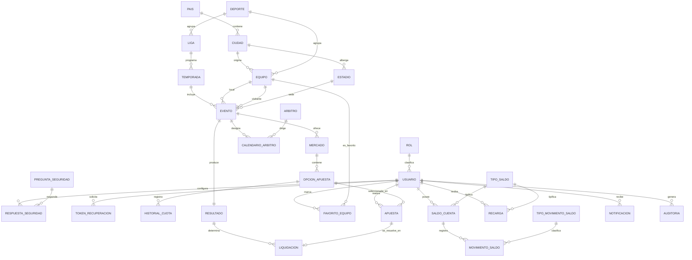

# Modelo conceptual del negocio — ApuestaDB (Fase 2)

**Fecha:** 14/sep/2026 · **Asignatura:** Bases de Datos 2 (Tecnológico de Antioquia)
**Integrantes:** Jhon Bayron Peláez Guerra · Shantal Coneo García
**Fuente exclusiva:** Fase 1 (`docs/ACTUAL/requisitos/`).
**Nivel:** conceptual. **No** hay tablas, claves, tipos de datos ni motor.

> Este documento responde a las tareas 5, 6 y 8: entidades fuertes y débiles, entidades asociativas y el **modelo entidad-relación conceptual**.

---

## 1. Visión general

El negocio se organiza en **6 dominios** y **29 entidades**:

| Dominio | Entidades |
|---|---|
| 1. Seguridad y usuarios | Rol, Usuario, PreguntaSeguridad, RespuestaSeguridad, TokenRecuperacion |
| 2. Catálogo deportivo | Pais, Ciudad, Estadio, Deporte, Liga, Temporada, Equipo, Arbitro, Evento, CalendarioArbitro, Mercado, OpcionApuesta, HistorialCuota |
| 3. Apuestas | Apuesta, FavoritoEquipo |
| 4. Saldo ficticio | TipoSaldo, SaldoCuenta, MovimientoSaldo, TipoMovimientoSaldo, Recarga |
| 5. Resultados y liquidación | Resultado, Liquidacion |
| 6. Auditoría y soporte | Notificacion, Auditoria |

Detalle en `ENTIDADES.md`, `RELACIONES.md`, `CARDINALIDADES.md` y `DICCIONARIO_CONCEPTUAL.md`.

---

## 2. Entidades fuertes y débiles

### Entidades fuertes (tienen existencia propia)
Rol · Usuario · PreguntaSeguridad · Pais · Ciudad · Estadio · Deporte · Liga · Temporada · Equipo · Arbitro · Evento · Mercado · OpcionApuesta · Apuesta · TipoSaldo · TipoMovimientoSaldo · Recarga · Resultado · Auditoria.

### Entidades débiles (dependen de otra entidad)
| Entidad débil | Depende de | Motivo |
|---|---|---|
| TokenRecuperacion | Usuario | no existe sin el usuario que lo solicita |
| HistorialCuota | OpcionApuesta | registra la evolución de una opción concreta |
| MovimientoSaldo | SaldoCuenta | cada movimiento pertenece a una cuenta de saldo |
| Notificacion | Usuario | aviso dirigido a un usuario |

### Entidades asociativas (resuelven relaciones N:M)
| Entidad asociativa | Resuelve |
|---|---|
| RespuestaSeguridad | Usuario ↔ PreguntaSeguridad |
| CalendarioArbitro | Evento ↔ Arbitro |
| FavoritoEquipo | Usuario ↔ Equipo |
| SaldoCuenta | Usuario ↔ TipoSaldo |
| Liquidacion | Apuesta ↔ Resultado |

---

## 3. Modelo entidad-relación conceptual

Diagrama conceptual (notación pie de gallo; solo entidades, relaciones y cardinalidades):

### Lectura del diagrama

- **`||--o{`** = uno a muchos (uno obligatorio, muchos opcionales).
- **`||--||`** = uno a uno (Evento ↔ Resultado).
- **`||--o|`** = uno a cero o uno (Apuesta ↔ Liquidación: se resuelve a lo sumo una vez).
- El núcleo transaccional es: **Usuario → Apuesta → OpcionApuesta → Mercado → Evento → Resultado → Liquidación → MovimientoSaldo → SaldoCuenta**.

---

## 4. Reglas de negocio reflejadas en el modelo

| Regla (Fase 1) | Cómo se refleja conceptualmente |
|---|---|
| RN-01..RN-06 (saldo tokens/PSE) | TipoSaldo + SaldoCuenta (una cuenta por tipo) + Recarga; sin conversión |
| RN-07/RN-08 (monto y saldo) | Apuesta.monto y validación contra SaldoCuenta.saldo_actual |
| RN-09 (evento válido) | Evento.estado |
| RN-10/RN-11 (cuota congelada) | Apuesta.cuota_congelada + HistorialCuota |
| RN-12/RN-13 (transacción) | Apuesta + MovimientoSaldo aplicados de forma atómica |
| RN-14 (una sola liquidación) | Relación Apuesta (0,1) ↔ Liquidacion |
| RN-15 (resultado oficial) | Evento ↔ Resultado (1:1) |
| RN-16 (no jugar contra sí mismo) | Dos roles de Equipo en Evento (local ≠ visitante) |
| RN-17 (opción ↔ mercado ↔ evento) | Cadena Evento → Mercado → OpcionApuesta |
| RN-18/RN-19 (trazabilidad) | MovimientoSaldo + Auditoria |

---

## 5. Evaluación: ¿hay información suficiente?

**Sí.** Existe información suficiente para construir el **modelo lógico relacional** y para las **futuras 29 tablas**, con las siguientes precisiones:

1. **Correspondencia 1:1 entidad–tabla:** las **29 entidades** de este modelo conceptual se proyectan, en el modelo lógico, en el orden de **29 tablas** (entidades fuertes y asociativas como tablas propias; las débiles ligadas a su entidad propietaria).
2. **Relaciones resueltas:** las relaciones N:M ya quedaron cubiertas por entidades asociativas (RespuestaSeguridad, CalendarioArbitro, FavoritoEquipo, SaldoCuenta, Liquidacion), y las 1:N se resolverán en el modelo lógico mediante referencias entre tablas.
3. **Catálogos identificados como tablas de apoyo:** Rol, TipoSaldo, TipoMovimientoSaldo, Pais, Deporte, y los estados (como dominios de valores) completan el conteo de tablas.

### Reservas (no bloquean, pero deben validarse antes de cerrar el modelo lógico)

- **Entidades marcadas PROPUESTA:** Pais, Ciudad, Estadio, Deporte, Liga, Temporada, Equipo, Arbitro, CalendarioArbitro, Mercado, OpcionApuesta, HistorialCuota, FavoritoEquipo, PreguntaSeguridad, RespuestaSeguridad, TokenRecuperacion, TipoMovimientoSaldo, Notificacion. Dependen de validación de Jhon/profesor.
- **DUDA del profesor aún abiertas:** contenido de `Servicios` y `Reglas`; `Apuestas` (oferta) vs `HacerApuesta` (apuesta del cliente); tratamiento de `Resultado`.
- **Alcance:** fútbol como deporte único y mercado "resultado del partido" siguen siendo propuesta.

---

## 6. Pendientes y próximo paso

- Resolver las DUDA del profesor antes de fijar el modelo lógico.
- Validar el conjunto de entidades PROPUESTA y el conteo final de tablas.

**No se avanza automáticamente.** Se esperan instrucciones de Jhon para la Fase 3 (modelo lógico relacional).
