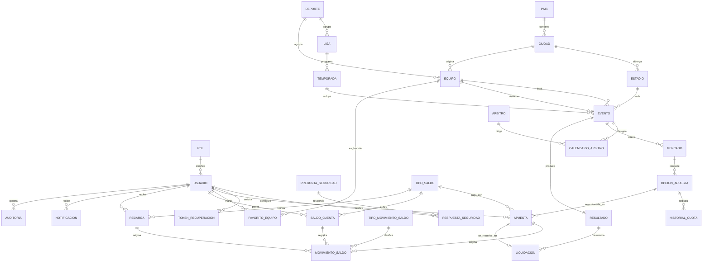

# Modelo lógico relacional — ApuestaDB (Fase 3)

**Fecha:** 14/sep/2026 · **Asignatura:** Bases de Datos 2 (Tecnológico de Antioquia)
**Integrantes:** Jhon Bayron Peláez Guerra · Shantal Coneo García
**Fuente:** modelo conceptual aprobado (`docs/ACTUAL/modelo_conceptual/`).
**Nivel:** lógico relacional. **Sin** SQL, `CREATE TABLE`, tipos de datos, índices, triggers ni procedimientos.

---

## 1. Criterios de transformación

| Elemento conceptual | Resultado lógico |
|---|---|
| Entidad fuerte | Tabla propia con clave primaria |
| Entidad asociativa (N:M) | Tabla propia con clave candidata compuesta |
| Entidad débil | Tabla propia con FK hacia su propietaria |
| Relación 1:N | FK en el lado "muchos" |
| Relación 1:1 | FK única en el lado de participación parcial |
| Relación N:M | Tabla asociativa |
| Atributo compuesto | Se descompone en atributos simples (no se almacena el compuesto) |
| Atributo derivado | No se almacena; se calcula |
| Atributo multivaluado | Se simplifica o se lleva a tabla propia |

---

## 2. Mapa conceptual → lógico

| Destino | Entidades conceptuales |
|---|---|
| **Tabla propia** (20) | Rol, Usuario, PreguntaSeguridad, Pais, Ciudad, Estadio, Deporte, Liga, Temporada, Equipo, Arbitro, Evento, Mercado, OpcionApuesta, Apuesta, TipoSaldo, TipoMovimientoSaldo, Recarga, Resultado, Auditoria |
| **Tabla asociativa** (5) | RespuestaSeguridad, CalendarioArbitro, FavoritoEquipo, SaldoCuenta, Liquidacion |
| **Tabla dependiente** (débil, 4) | TokenRecuperacion, HistorialCuota, MovimientoSaldo, Notificacion |
| **Atributos de otra tabla** (0 entidades) | Ninguna entidad se degradó a atributo: se preservó cada una como tabla. Solo **atributos** (no entidades) se ajustaron: `nombre_completo` (compuesto/derivado, no se almacena), `telefono` multivaluado (reducido a atributo simple opcional) y —tras la Fase 4.1— `MovimientoSaldo.clase_movimiento` y `Resultado.opcion_ganadora` (eliminados por normalización); `cuota_vigente` se conserva como redundancia controlada. |

**Conclusión del mapeo:** 29 entidades → **29 tablas** (20 propias + 5 asociativas + 4 dependientes).

---

## 3. Diagrama lógico relacional

Relaciones del modelo lógico (notación pie de gallo; sin atributos ni tipos para no salir del nivel lógico):

**Lectura:** `||--o{` uno a muchos · `||--||` uno a uno · `||--o|` uno a cero o uno.

---

## 4. Verificación de redundancias

| Posible solapamiento | Veredicto | Motivo |
|---|---|---|
| Recarga vs MovimientoSaldo | **No redundante** | Recarga documenta el origen y su sustento; MovimientoSaldo registra el efecto sobre el saldo (RF-22, RN-18). |
| OpcionApuesta.cuota_vigente vs HistorialCuota | **No redundante** | la cuota vigente es derivada; HistorialCuota conserva la evolución (RN-10/RN-11). |
| SaldoCuenta vs MovimientoSaldo | **No redundante** | una guarda el saldo actual; el otro, cada variación (trazabilidad). |
| TipoSaldo vs TipoMovimientoSaldo | **No redundante** | uno tipifica el saldo (tokens/PSE); el otro, el concepto del movimiento (apuesta/premio/recarga). |
| Apuesta.id_tipo_saldo vs SaldoCuenta | **No redundante** | Apuesta guarda el tipo usado, no la cuenta completa (evita dependencia transitiva). Ver D-08. |
| Resultado vs Evento | **No redundante** | el resultado es un hecho posterior y separado del catálogo del evento. |
| Liquidacion vs Apuesta | **No redundante** | la liquidación es el cierre posterior y único de la apuesta. |
| Pais/Ciudad/Estadio/Temporada/Arbitro | **No redundantes** | normalizan datos que, de otro modo, se repetirían en equipos y eventos. |

**Resultado:** no se identifican tablas redundantes.

---

## 5. Trazabilidad de reglas de negocio

| Regla | Dónde queda representada |
|---|---|
| RN-01 saldo por tipos | TipoSaldo + SaldoCuenta |
| RN-02 saldo inicial en cero | SaldoCuenta (regla de creación) |
| RN-03 un solo tipo por apuesta | Apuesta.id_tipo_saldo (un solo valor) |
| RN-04 premio al mismo tipo | Liquidacion + MovimientoSaldo sobre la misma cuenta |
| RN-05 sin conversión entre tipos | inexistencia de tabla de conversión (restricción de proceso) |
| RN-06 recarga de ambos tipos | Recarga.id_tipo_saldo |
| RN-07 monto mayor que cero | Apuesta.monto (restricción de dominio) |
| RN-08 monto ≤ saldo disponible | validación contra SaldoCuenta.saldo_actual |
| RN-09 evento válido | Evento.estado |
| RN-10 cuota congelada | Apuesta.cuota_congelada |
| RN-11 cambio de cuota no altera la apuesta | Apuesta conserva su copia + HistorialCuota |
| RN-12/RN-13 atomicidad | Apuesta + MovimientoSaldo en una transacción |
| RN-14 una sola liquidación | CK única `id_apuesta` en Liquidacion |
| RN-15 resultado oficial | Resultado vinculado al Evento |
| RN-16 no jugar contra sí mismo | Evento: `id_equipo_local` ≠ `id_equipo_visitante` |
| RN-17 opción → mercado → evento | cadena Evento → Mercado → OpcionApuesta |
| RN-18 todo cambio de saldo genera movimiento | MovimientoSaldo |
| RN-19 trazabilidad de movimientos | MovimientoSaldo + Auditoria |
| RN-20 contraseña protegida | Usuario.contrasena (almacenada protegida) |
| RN-21 fechas y estados validados | columnas de estado y fecha en Evento, Apuesta, Mercado, etc. |

**Resultado:** las 21 reglas de negocio siguen representadas en el modelo lógico.

---

## 6. Conclusión

El modelo lógico relacional queda formado por **29 tablas**, sin redundancias y con las 21 reglas de negocio representadas. Está en condiciones de pasar a la **auditoría de normalización** (análisis de dependencias funcionales y verificación de formas normales).

---

## 7. Revisión Fase 4.1 — Correcciones de normalización

Tras la auditoría, se aplicaron dos correcciones para alcanzar 3FN completa:

- **C-1:** se eliminó `MovimientoSaldo.clase_movimiento` (duplicaba `TipoMovimientoSaldo.naturaleza`).
- **C-2:** se eliminó `Resultado.opcion_ganadora` (derivable del marcador); el marcador es la fuente de verdad.

Las 5 redundancias controladas (`cuota_vigente`, `saldo_actual`, `saldo_resultante`, `monto_premio`, `resultado_liquidacion`) se conservan documentadas. Verificación final: **1FN, 2FN y 3FN en 29/29 tablas.**
