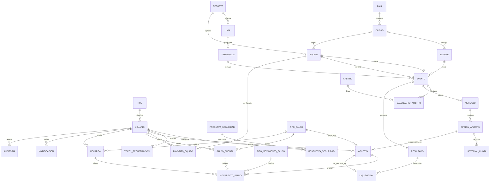

# Modelo físico — ApuestaDB (SQL Server · Fase 6)

**Fecha:** 14/sep/2026 · **Asignatura:** Bases de Datos 2 (Tecnológico de Antioquia)
**Integrantes:** Jhon Bayron Peláez Guerra · Shantal Coneo García
**Motor:** Microsoft SQL Server · **Herramienta:** SQL Server Management Studio (SSMS)
**Base:** modelo lógico normalizado en 3FN + diccionario de datos (Fases 1–5).
**Alcance:** 29 tablas. **No** se generan `CREATE DATABASE`, `CREATE TABLE`, stored procedures, views, functions ni triggers (solo diseño).

---

## 1. Objetivo

Definir el modelo físico completo —tipos de datos, longitudes, nulabilidad, claves, restricciones, valores por defecto, índices y estrategia de integridad— listo para convertirse en el script SQL de creación.

## 2. Convenciones de tipos

| Uso | Tipo SQL Server | Justificación |
|---|---|---|
| Identificador sustituto (normal) | `INT IDENTITY(1,1)` | rango suficiente y bajo costo |
| Identificador sustituto (alto volumen) | `BIGINT IDENTITY(1,1)` | tablas de registro (log) de crecimiento alto |
| Fecha | `DATE` | fechas sin hora |
| Fecha y hora | `DATETIME2(3)` | precisión de milisegundos, recomendado por Microsoft |
| Importes ficticios (saldo, monto, premio) | `DECIMAL(18,2)` | exactitud monetaria (sin errores de coma flotante) |
| Cuota | `DECIMAL(10,2)` | valores como 1.85, 2.50 |
| Marcador | `SMALLINT` | anotaciones, entero ≥ 0 |
| Capacidad | `INT` | aforo, entero ≥ 0 |
| Estados (dominios cerrados) | `VARCHAR(20)` + `CHECK` | valores simples; se validan con restricción |
| Naturaleza de movimiento | `VARCHAR(10)` + `CHECK` | débito/crédito |
| Nombres y textos | `NVARCHAR(n)` | soporte de caracteres Unicode (tildes) |
| Credenciales (hash) | `VARCHAR(255)` | almacena el hash (no texto plano) |
| Token | `VARCHAR(128)` | cadena aleatoria única |

**Valor por defecto temporal:** `SYSDATETIME()` para marcas de tiempo.
**Estados con valor por defecto:** se inicializan al valor de negocio obvio (activo, vigente, programado, pendiente, abierto, habilitada, aplicada, provisional, no_leida).

## 3. Resumen físico de las 29 tablas

| # | Tabla | PK | Tipo PK | Clustered | FK | Índices NC | Volumen estimado |
|---|---|---|---|---|---|---|---|
| T-01 | Rol | id_rol | INT IDENTITY | PK | 0 | 1 (UQ) | bajo |
| T-02 | Usuario | id_usuario | INT IDENTITY | PK | 1 | 2 | medio |
| T-03 | PreguntaSeguridad | id_pregunta | INT IDENTITY | PK | 0 | 1 (UQ) | bajo |
| T-04 | RespuestaSeguridad | id_respuesta | INT IDENTITY | PK | 2 | 2 | medio |
| T-05 | TokenRecuperacion | id_token | INT IDENTITY | PK | 1 | 2 | medio |
| T-06 | Pais | id_pais | INT IDENTITY | PK | 0 | 2 (UQ) | bajo |
| T-07 | Ciudad | id_ciudad | INT IDENTITY | PK | 1 | 2 | medio |
| T-08 | Estadio | id_estadio | INT IDENTITY | PK | 1 | 2 | medio |
| T-09 | Deporte | id_deporte | INT IDENTITY | PK | 0 | 1 (UQ) | bajo |
| T-10 | Liga | id_liga | INT IDENTITY | PK | 1 | 2 | bajo |
| T-11 | Temporada | id_temporada | INT IDENTITY | PK | 1 | 2 | bajo |
| T-12 | Equipo | id_equipo | INT IDENTITY | PK | 2 | 3 | medio |
| T-13 | Arbitro | id_arbitro | INT IDENTITY | PK | 0 | 1 | bajo |
| T-14 | Evento | id_evento | INT IDENTITY | PK | 4 | 6 | medio-alto |
| T-15 | CalendarioArbitro | id_calendario | INT IDENTITY | PK | 2 | 3 | medio |
| T-16 | Mercado | id_mercado | INT IDENTITY | PK | 1 | 2 | medio |
| T-17 | OpcionApuesta | id_opcion | INT IDENTITY | PK | 1 | 2 | medio-alto |
| T-18 | HistorialCuota | id_historial | BIGINT IDENTITY | PK | 1 | 2 | alto |
| T-19 | Apuesta | id_apuesta | INT IDENTITY | PK | 4 | 4 | alto |
| T-20 | FavoritoEquipo | id_favorito | INT IDENTITY | PK | 2 | 3 | medio |
| T-21 | TipoSaldo | id_tipo_saldo | INT IDENTITY | PK | 0 | 1 (UQ) | bajo |
| T-22 | SaldoCuenta | id_saldo_cuenta | INT IDENTITY | PK | 2 | 3 | medio |
| T-23 | MovimientoSaldo | id_movimiento | BIGINT IDENTITY | PK | 4 | 5 | muy alto |
| T-24 | TipoMovimientoSaldo | id_tipo_movimiento | INT IDENTITY | PK | 0 | 1 (UQ) | bajo |
| T-25 | Recarga | id_recarga | INT IDENTITY | PK | 2 | 3 | medio |
| T-26 | Resultado | id_resultado | INT IDENTITY | PK | 1 | 1 (UQ) | medio |
| T-27 | Liquidacion | id_liquidacion | INT IDENTITY | PK | 2 | 2 | alto |
| T-28 | Notificacion | id_notificacion | BIGINT IDENTITY | PK | 1 | 2 | alto |
| T-29 | Auditoria | id_auditoria | BIGINT IDENTITY | PK | 1 | 3 | muy alto |

## 4. Relaciones físicas (FK)

## 5. Decisiones de diseño físico

| # | Decisión | Motivo |
|---|---|---|
| F-01 | PK sustitutas `INT IDENTITY` | claves estables, inserción secuencial, sin cambios de negocio |
| F-02 | `BIGINT IDENTITY` en MovimientoSaldo, HistorialCuota, Auditoria, Notificacion | tablas de registro con crecimiento alto |
| F-03 | `DECIMAL(18,2)` para importes | exactitud monetaria (evita errores de `FLOAT`) |
| F-04 | Estados como `VARCHAR(20)` + `CHECK` (no tablas catálogo) | dominios cerrados y estables; validación declarativa |
| F-05 | Nombres/textos en `NVARCHAR` | soporte de tildes y caracteres especiales |
| F-06 | Credenciales en `VARCHAR(255)` (hash) | nunca texto plano (RN-20) |
| F-07 | `DATETIME2(3)` para marcas temporales | precisión recomendada por SQL Server |
| F-08 | Snapshots controlados mantenidos por transacción | cuota vigente, saldo actual, saldo resultante, premio, resultado de liquidación |
| F-09 | FK compuesta `Apuesta (id_usuario, id_tipo_saldo) → SaldoCuenta` | garantiza que la cuenta afectada existe y es del usuario/tipo |
| F-10 | Sin `CASCADE` sobre datos transaccionales | protege la integridad de apuestas, saldos y liquidaciones |

## 6. Correspondencia con el diccionario

Cada columna del diccionario de datos (`docs/ACTUAL/diccionario_datos/`) tiene aquí su tipo físico, longitud, nulabilidad y valor por defecto (ver `TIPOS_DATOS.md`), sus claves y restricciones (`CLAVES_Y_RESTRICCIONES.md`) y sus índices (`INDICES.md`).
